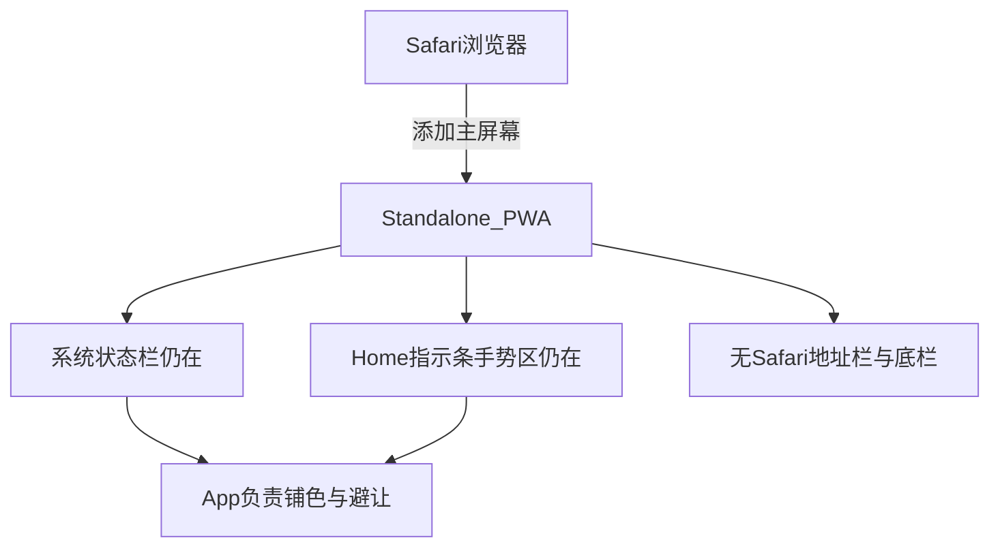
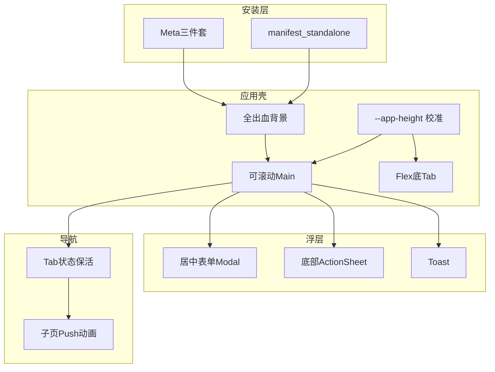

# 安崽 — iOS 全屏设计（合并文档）

> 主屏幕 PWA（standalone）全屏与原生交互的**唯一**设计文档。  
> 含：结论路径、七方面注意事项、分项分析、技术细节、落地状态、验收清单。  
> 日期：2026-08-05（合并自原《体验分析》与《注意事项与分析报告》）  
> 另见：[需求备忘.md](./需求备忘.md)、[交互基础规范.md](./交互基础规范.md)（Tab/按钮/Toast 等小细节令牌）

---

## 目录

1. [结论先看](#1-结论先看)
2. [七方面总览](#2-七方面总览)
3. [分项分析报告](#3-分项分析报告)
4. [技术补充](#4-技术补充)
5. [推荐架构与落地状态](#5-推荐架构与落地状态)
6. [真机验收清单](#6-真机验收清单)
7. [迭代优先级](#7-迭代优先级)
8. [七方面最佳实践导入对照](#8-七方面最佳实践导入对照已落地)
9. [参考资料](#9-参考资料)
10. [变更记录](#10-变更记录)

---

## 1. 结论先看

在 iPhone 上，真正可用的「全屏」**不是** `display: fullscreen`，而是：

1. Safari → **添加到主屏幕**
2. Manifest：`display: "standalone"`
3. Meta 三件套：`viewport-fit=cover` + `apple-mobile-web-app-capable` + `black-translucent`
4. **背景铺到物理边缘**；**可点 UI 只在 Safe Area 内**
5. 底部 Tab：**flex 文档流子元素**，慎用 `position: fixed`
6. 弹窗：**表单居中卡**；**选择器 Action Sheet**；输入 ≥ 16px

**一句话策略：** 背景贴边、控件避让、壳用真高度、Tab 走文档流、表单居中弹、选择器见底、一切以「主屏幕图标冷启动」验收。

桌面手机外框只作开发预览，**不能代替真机 standalone**（`env(safe-area-*)` 常为 0）。



| 模式 | iOS | 说明 |
|---|---|---|
| `display: fullscreen` | 基本不可用 | 偏 Android / 游戏 |
| `display: standalone` | **正解** | 最接近原生 |
| Safari 内页 | 有地址栏 | 不是全屏 App |

| `status-bar-style` | 内容是否进状态栏下 | 安崽 |
|---|---|---|
| `default` / `black` | 否 | 不够贴边 |
| `black-translucent` | 是 | **必选**（暗色） |

改 meta 后需 **删图标重装**（安装时缓存）。

---

## 2. 七方面总览

| # | 方面 | 一句话 |
|---|---|---|
| 1 | 安装与模式 | 全屏靠「添加到主屏幕 + standalone」，不是 Safari 内页 |
| 2 | 刘海 / 灵动岛（上） | 背景可贴边，控件必须避让 |
| 3 | Home 区（下） | 底栏背景可贴底，图标抬高；慎用 fixed |
| 4 | 高度与视口 | 冷启动视口会撒谎，要校准壳高度 |
| 5 | 导航切换 | Tab 保活；子页推入并藏底栏 |
| 6 | 弹窗与键盘 | 有输入居中卡；选择用 Action Sheet |
| 7 | 触控手感与验收 | 真机图标冷启动验收，桌面框仅预览 |

每项结构：问题本质 → 设计原则 → 反模式 → 验收 → 对本项目。

---

## 3. 分项分析报告

### 3.1 安装与模式

**问题本质**  
Safari 内页永远有浏览器铬，安全区也与主屏幕 App 不同。全屏 App 感几乎只来自：  
`分享 → 添加到主屏幕 → 从图标启动`。

**设计原则**

1. Manifest：`standalone`，`background_color` / `theme_color` 与壳同色（`#000`）  
2. Meta 三件套齐全  
3. 必须 HTTPS  
4. 未安装时展示「分享 → 添加到主屏幕」引导  
5. 改 meta 后引导用户删图标重装  

**反模式**  
只在桌面/Safari 标签验收；指望 `fullscreen` 藏状态栏；HTTP。

**验收**  
图标启动无地址栏；`navigator.standalone` 或 `display-mode: standalone`；状态栏半透明；有安装引导。

**对本项目**  
已具备 manifest、三件套、`InstallPrompt`、反代 HTTPS。可加强多尺寸启动图。

---

### 3.2 刘海 / 灵动岛（上）

**问题本质**

| 层 | 可否进危险区 | 作用 |
|---|---|---|
| 全出血背景 | 可以 | 贴物理顶，无异色条 |
| 可交互内容 | 不可以 | 不得压时间 / 岛 |

`black-translucent` 后避让全在 App。

**典型 inset（portrait / standalone）**

| 机型 | `safe-area-inset-top` 约 |
|---|---|
| Home 键老机 | ~20pt |
| 刘海 | ~44–47pt |
| 灵动岛 | ~59pt 级 |

横屏时左右 inset 对称增大。

**设计原则**  
`env(safe-area-inset-top)` 下推标题；顶栏与背景同色；暗底保状态栏可读；真机不画假刘海（仅桌面预览用）。

**反模式**  
按钮进刘海；假状态栏叠系统时间；忽略横屏左右 inset。

**验收**  
标题不进刘海；顶无断层；Island / 刘海机均可读；standalone 无假硬件。

**对本项目**  
预览假刘海；`is-native-shell` 关闭；`padding-top` 用 safe-top。

---

### 3.3 Home 区（下）

**问题本质**  
底部约 **34pt** 手势热区。指示条可淡出，inset 仍在。  
完美态：背景贴物理底（无白缝）+ 图标在指示条之上。

**设计原则**

1. Tab 作 **flex 最后一项**，不用 `fixed; bottom: 0`  
2. `padding-bottom: max(env(safe-area-inset-bottom, 0px), 34px)`  
3. 毛玻璃底栏更接近 UITabBar  
4. 子页隐藏 Tab  
5. Toast / 引导条避开 Tab + safe-bottom  

**白缝根因（高频）**

- 冷启动 `100dvh` / `innerHeight` 少一截（常等于 top inset）  
- 或 `100dvh` 已扣 bottom 再加 padding → 双重扣除  

**壳策略**

```
shell: height 100vh(standalone) / 校准后的 --app-height
  main: flex-1, overflow auto
  tabbar: flex-shrink-0, padding-bottom: safe-bottom
```

**反模式**  
fixed 底栏；主按钮贴 `bottom:0` 无 inset；用桌面 env 判断有无缝。

**验收**  
无白缝；图标完整；冷启动仍正确。

**对本项目**  
已 flex Tab + 34px floor + `--app-height` 重测。

---

### 3.4 高度与视口

**问题本质**  
standalone 冷启动时 `100dvh` / `svh` / `innerHeight` / `visualViewport` 常偏短 → 底缝或「用着用好了」（docking）。  
Safari 与 standalone 高度策略必须分开。

**设计原则**

1. `--app-height`，启动后 0/100/500/1000ms 及 resize 校准  
2. standalone 优先 `screen.height` / `100vh`；键盘跟 `visualViewport`  
3. `html/body` overflow hidden，仅 main 滚  
4. `overscroll-behavior: contain`  
5. `display-mode` + `navigator.standalone` 双检测  

**反模式**  
死写 `100dvh`；双滚动；只测热缓存实例不冷启动。

**验收**  
新装/杀进程贴满；旋转正常；键盘下按钮可见。

**对本项目**  
`useAppViewport` 已实现。

---

### 3.5 导航切换

**问题本质**  
原生：Tab 保活 + 子页 Push/Pop。Web 每次卸载 Tab = 闪白丢滚动。

**设计原则**

1. 主 Tab **保活**（隐藏非销毁）  
2. 切换动画 ≤200ms  
3. 子页右侧推入；可渐进做边缘返回  
4. 子页 **藏底 Tab**  
5. `router.replace` + `scroll={false}`  

进阶：横向 scroll-snap 更像原生。

**反模式**  
硬刷新跳 Tab；子页仍露四 Tab；过炫转场；长列表塞 Modal。

**验收**  
切 Tab 滚位保留；不闪白；子页无底栏。

**对本项目**  
`TabCache` 已保活；`app-shell-no-tab` 已预留。待：详情转场。

---

### 3.6 弹窗与键盘

> **全站强制契约（含验收与反模式）：[弹窗键盘规范.md](./弹窗键盘规范.md)**  
> 凡带输入的弹窗 → 只许 `CenterModal`；效果：底页冻结，仅 `.modal-lift` 上移。

**问题本质**  
iOS Safari 在 **focus 之前**做「键盘升起后是否可见」预测，可能滚动 layout viewport。  
`interactive-widget` 在 WebKit **未实现**（[bug 259770](https://bugs.webkit.org/show_bug.cgi?id=259770)）。  
键盘改的是 **visualViewport**；事后 `scrollTo` / 缩壳高会与系统对打 →「先下滑再上弹」。

**选型**

| 场景 | 形态 |
|---|---|
| 要打字（加持仓等） | **`CenterModal`**（底页冻；仅卡片随 `--keyboard-inset` 上移） |
| 中部搜索（市场页内嵌） | 全局 **Focus Guard**；壳高不缩 |
| 删除 / 菜单 | **Action Sheet**（冻底页，无 lift） |
| 轻反馈 | **Toast** |

**分层架构（已落地）**

| 层 | 职责 | 实现 |
|---|---|---|
| L0 | 文档不滚，仅主区/列表滚 | `overflow:hidden` + `.app-main` |
| L1 | focus 前接管，禁止系统滚入 | `useIOSFocusGuard`（modal 内预览也开） |
| L2 | 布局高稳定 | `--app-height` 不跟键盘缩 |
| L3 | 仅卡片抬升 | `--keyboard-inset` → `.modal-lift` `translateY(-50%)` |
| L4 | Tab 淡出占位 | `data-keyboard` + opacity |
| L5 | 底页冻结 | `lockUnderlyingScroll` + `data-modal` |
| L6 | standalone 视口卡住 | blur heal |

**反模式**  
自研 portal 弹层；`scrollIntoView`；用 `--vv-height` 缩遮罩；键盘时缩 `--app-height`；`display:none` 卸 Tab 占位；只靠 meta `interactive-widget`。

**验收**  
聚焦 Modal 输入：**底页静止**；**卡片上移**；输入在键盘上方；关闭后无底缝。

**对本项目**  
`useAppViewport` + `useIOSFocusGuard` + `CenterModal` + `lib/iosKeyboard.ts`。

---

### 3.7 触控手感与验收

**问题本质**  
灰闪、长按菜单、误选数字破坏 App 感。桌面框 ≠ 真机。

**设计原则**  
去 tap highlight + 自绘 pressed；数字区禁选；热区 ≥44pt；验收固定流程：  
`HTTPS → 添加到主屏幕 → 杀进程 → 冷启动 → 测顶/底/Tab/弹窗/键盘`。

**反模式**  
只在预览签字；忽略冷启动。

**对本项目**  
触控基础样式与安装引导已加。

**其他打磨**

| 项 | 建议 |
|---|---|
| 启动图 | `apple-touch-startup-image` |
| 图标 | 180 `apple-touch-icon` |
| 下拉刷新 | 挂列表，防整页露白 |
| 缓存 | 改安全区后注意 iOS 强缓存 / 重装 |

---

## 4. 技术补充

### 4.1 Safe-area CSS 示例

```css
.tabbar {
  padding-bottom: max(env(safe-area-inset-bottom, 0px), 34px);
}
```

### 4.2 预览 vs 真机

| 项 | 桌面预览 | 真机 standalone |
|---|---|---|
| 假刘海 / 假电池 | 可显示 | **关闭** |
| Tab | flex 贴底 | flex 贴底 |
| safe | 可用写死模拟 | **`env()` + floor** |
| 壳高 | 外框限制 | `--app-height` / `100vh` |

### 4.3 滚动

- 仅 `main` 滚动；`-webkit-overflow-scrolling: touch`  
- `overscroll-behavior: contain`

---

## 5. 推荐架构与落地状态



| 能力 | 状态（2026-08-07） |
|---|---|
| Meta / viewport-fit / standalone | 已落地；安装引导（iOS + `beforeinstallprompt`）+ 设置内常驻入口 |
| iOS 启动图 | `apple-touch-startup-image` 多机型 + 180 icon；manifest 暗色 `theme_color` |
| 预览外框 vs 真机壳 | 宽屏改为居中限宽 App 列（无假刘海/手机框）；真机 `nativeShell` |
| Tab | flex 贴底 + safe；子页 Push 时隐藏 TabBar（`ShellChrome`） |
| safe-area | `calc(间距+env)` + 34px floor + 左右 inset |
| 视口/键盘 | visualViewport、`focus` scroll-reset、blur heal |
| 弹窗 | CenterModal / ActionSheet / Toast |
| Tab 保活 | `TabCache` |
| 子页 Push / 边缘返回 | `useShellStack` + `ShellLayer`（安崽设置/历史、新闻阅读） |
| 离线壳 | `public/sw.js` 预缓存壳；API network-first；`OfflineBanner` |

关键代码：`AppleSplashLinks`、`useAppViewport`、`AppShell`、`TabBar`、`TabCache`、`ShellStack`、`InstallPrompt`、`sw.js`、`globals.css`、`overlay/*`。

---

## 6. 真机验收清单

流程：反代 HTTPS → 分享 → 添加到主屏幕 → **图标冷启动**（勿在 Safari 内验全屏）。

- [ ] 无 Safari 铬；standalone 成立  
- [ ] 顶：标题不进刘海；状态栏可读  
- [ ] 底：Tab 无白缝；图标在 Home 之上  
- [ ] 冷启动高度正确  
- [ ] Tab 切换保活、不闪白  
- [ ] 添加持仓 Modal + 键盘正常  
- [ ] 删除 Action Sheet 正常  
- [ ] Toast / 安装条不挡关键操作  
- [ ] 子页 Push + 边缘返回 / 系统返回  
- [ ] 无网可打开壳（SW）  
- [ ] 改 meta 异常时：删图标重装  

---

## 7. 迭代优先级

| 优先级 | 项 |
|---|---|
| P0 | 真机跑通验收清单 |
| ~~P1~~ | ~~子页 Push / 边缘返回~~ → 已落地（可继续扩到更多子页） |
| P2 | Tab 横向 scroll-snap |

---

## 8. 七方面最佳实践导入对照（已落地）

按七个方面检索业界方案并写入代码，对照如下：

| # | 方面 | 导入的最佳实践来源 | 代码落点 |
|---|---|---|---|
| 1 | 安装与模式 | [web.dev Enhancements](https://web.dev/learn/pwa/enhancements) 启动图；`navigator.standalone` 检测；Expo/ToolsDock splash media query | `AppleSplashLinks`、`public/splash/*`、`InstallPrompt`、layout meta |
| 2 | 刘海 | [Polypane safe-area](https://polypane.app/blog/using-safe-area-inset-to-build-mobile-safe-layouts/)：`calc(间距 + env())` | `globals.css` `--sat` + `padding-top` |
| 3 | Home 区 | [Cap-go safe-area skill](https://github.com/Cap-go/capgo-skills/blob/main/skills/safe-area-handling/SKILL.md) Tab 49pt + bottom inset；[nextjs-mobile-app-template](https://github.com/RhysSullivan/nextjs-mobile-app-template) flex 底栏；OpenClaw 34px floor | `.tabbar` flex + `--sab` |
| 4 | 高度与视口 | [iOS Hates Your Modal](https://medium.com/@rvwv/ios-hates-your-modal-a-ux-ui-playbook-for-pwas-on-base-8176d52aec48) `--app-height`←visualViewport；[piclaw](https://github.com/rcarmo/piclaw/blob/main/docs/PWA.md) focus scroll-reset；[DEV heal](https://dev.to/cederhook/fixing-the-ios-standalone-pwa-keyboard-bug-that-shrinks-your-viewport-for-good-63d) 键盘后重测 | `useAppViewport` |
| 5 | 导航切换 | [MDN / Chrome View Transitions](https://developer.mozilla.org/en-US/docs/Web/API/View_Transition_API) 渐进增强；Tab 保活 | `TabBar` + `startViewTransition`、`TabCache` |
| 6 | 弹窗与键盘 | Medium：居中 ≤92%、fade-up；overlay `height: var(--app-height)`；input ≥16px | `CenterModal`、`ActionSheet`、`.modal-overlay` |
| 7 | 触控与验收 | `touch-action: manipulation`；禁 tap 灰闪；iOS-only 安装引导 | `globals.css`、`InstallPrompt` |

左右安全区（横屏刘海）已同步加到 `main` / Tab / Modal：`--sal` / `--sar`。

---

## 9. 参考资料

| 来源 | 要点 |
|---|---|
| [web.dev — App design / Enhancements](https://web.dev/learn/pwa/enhancements) | standalone；iOS startup-image |
| [Apple Meta Tags](https://developer.apple.com/library/archive/documentation/AppleApplications/Reference/SafariHTMLRef/Articles/MetaTags.html) | capable / status-bar-style |
| [Polypane — safe-area-inset](https://polypane.app/blog/using-safe-area-inset-to-build-mobile-safe-layouts/) | calc + env |
| [Cap-go safe-area](https://github.com/Cap-go/capgo-skills/blob/main/skills/safe-area-handling/SKILL.md) | 全页 flex + Tab |
| [piclaw PWA.md](https://github.com/rcarmo/piclaw/blob/main/docs/PWA.md) | 冷启动视口；键盘 scroll-reset |
| [iOS Hates Your Modal](https://medium.com/@rvwv/ios-hates-your-modal-a-ux-ui-playbook-for-pwas-on-base-8176d52aec48) | --app-height；居中 Modal |
| [DEV — viewport heal](https://dev.to/cederhook/fixing-the-ios-standalone-pwa-keyboard-bug-that-shrinks-your-viewport-for-good-63d) | 键盘后视口卡住修复 |
| [nextjs-mobile-app-template](https://github.com/RhysSullivan/nextjs-mobile-app-template) | Tab 勿 fixed |
| [View Transition API](https://developer.mozilla.org/en-US/docs/Web/API/View_Transition_API) | Tab 切换转场 |
| [OpenClaw #77408](https://github.com/openclaw/openclaw/issues/77408) | bottom inset floor |

---

## 10. 变更记录

| 日期 | 说明 |
|---|---|
| 2026-08-05 | 体验分析初版 |
| 2026-08-05 | 七项注意事项与分项报告 |
| 2026-08-05 | 合并为本文 `iOS全屏设计.md` |
| 2026-08-05 | **七方面网站最佳实践检索并导入代码**（§8） |
| 2026-08-05 | 键盘开隐藏 TabBar；搜索框 ≥16px 防 iOS 放大 |
| 2026-08-05 | 键盘不缩壳高 + TabBar 占位淡出 + preventScroll，消除搜索焦点跳动 |
| 2026-08-05 | 调研落地 L0–L6：Focus Guard + `--vv-height` 分层；见调研画布 |
| 2026-08-05 | Modal Portal 到 bezel overlay-root；键盘顶对齐 + 表单输入样式 |
| 2026-08-05 | 弹窗键盘规范成文：底页冻 + 仅 `.modal-lift` 上移；全站强制 `CenterModal` |
